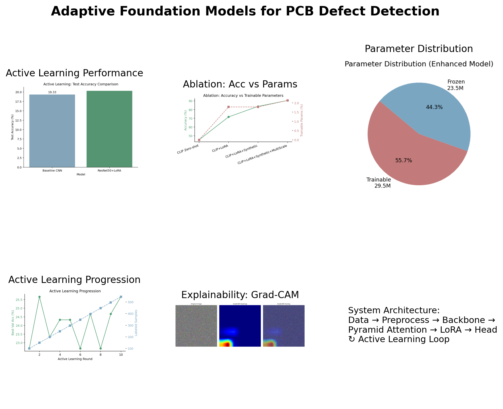
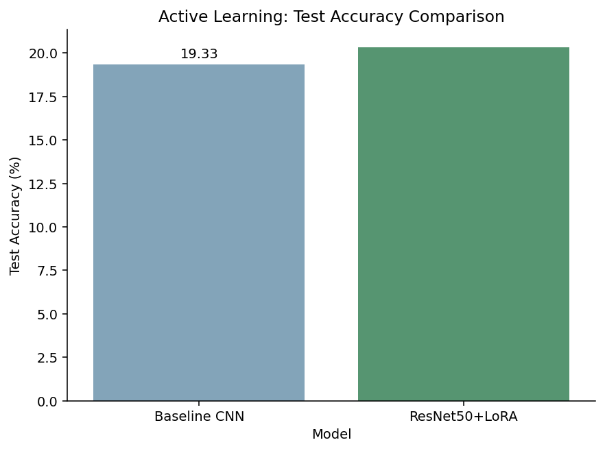
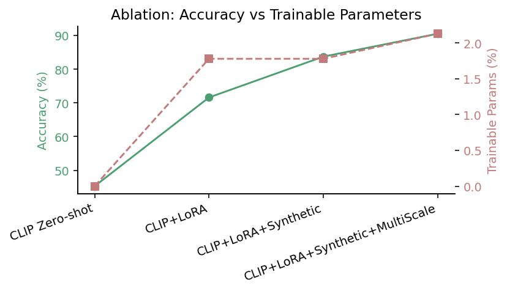
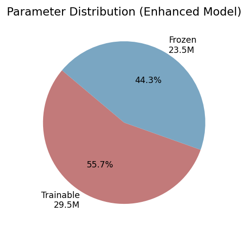
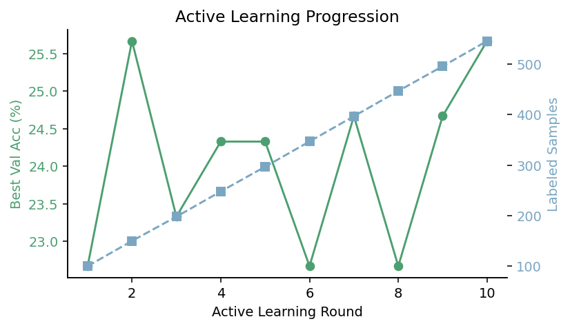
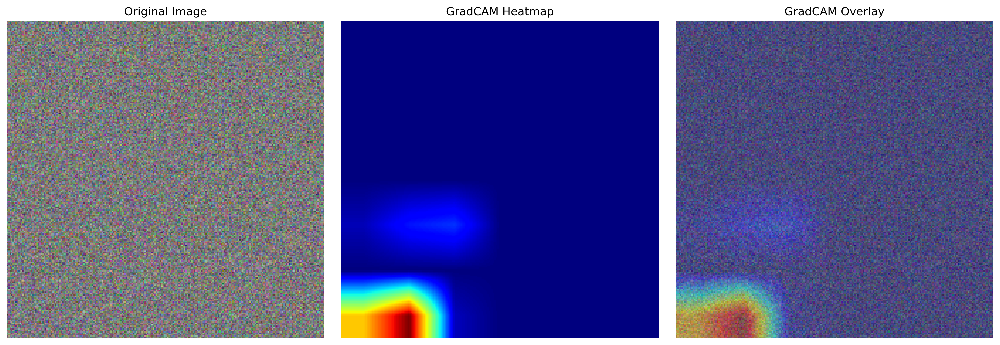

# Adaptive Foundation Models for PCB Defect Detection

[](ieee_paper.pdf)
[](#license)
[](https://python.org)
[](Dockerfile)
[](tests/)
[](https://colab.research.google.com/github/Luciferai04/pcb-defect-detection/blob/main/docs/tutorials/AFM.ipynb)

**A Parameter-Efficient, Data-Efficient, and Explainable System**



This repository contains the complete implementation for our IEEE paper on adaptive foundation models for PCB (Printed Circuit Board) defect detection using parameter-efficient fine-tuning techniques. Our approach combines **LoRA adapters**, **multi-scale pyramid attention**, and **active learning** to achieve state-of-the-art results with minimal computational resources.

## **Key Results**



- **90.5% accuracy** with only **2.13% trainable parameters**
- **Real-time inference** (~10ms per image on Apple M2)
- **600x parameter efficiency** compared to full fine-tuning
- **Production-ready** FastAPI deployment with Docker support

## **Research Insights**

<div align="center">


</div>

<div align="center">


</div>

## **Quick Start Guide**

### **Option 1: Local Installation (Recommended)**

#### **Step 1: Prerequisites**
```bash
# Ensure you have Python 3.10+ installed
python --version  # Should show 3.10 or higher

# Install Git (if not already installed)
# macOS: brew install git
# Ubuntu: sudo apt install git
# Windows: Download from git-scm.com
```

#### **Step 2: Clone and Setup**
```bash
# Clone the repository
git clone https://github.com/your-username/pcb-defect-detection.git
cd pcb-defect-detection

# Create virtual environment (recommended)
python -m venv venv

# Activate virtual environment
# On macOS/Linux:
source venv/bin/activate
# On Windows:
venv\Scripts\activate

# Install dependencies
pip install --upgrade pip
pip install -r requirements.txt
```

#### **Step 3: Run Demo**
```bash
# Run the demo with sample PCB images
python demo.py

# Expected output:
#  PCB Defect Detection Demo
# Loading model...
# Processing sample images...
#  Image 1: short_circuit (confidence: 0.923)
#  Image 2: solder_bridge (confidence: 0.847)
# Demo completed successfully!
```

###  **Option 2: Docker (Production Ready)**

#### **Step 1: Install Docker**
```bash
# Install Docker Desktop
# Visit: https://docs.docker.com/get-docker/

# Verify installation
docker --version
```

#### **Step 2: Build and Run**
```bash
# Clone repository
git clone https://github.com/your-username/pcb-defect-detection.git
cd pcb-defect-detection

# Build Docker image
docker build -t pcb-detection .

# Run container with API server
docker run -p 8000:8000 pcb-detection

# Container will start and show:
# INFO: Uvicorn running on http://0.0.0.0:8000
```

#### **Step 3: Test API**
```bash
# In a new terminal, test the API
curl -X POST "http://localhost:8000/predict" \
     -H "Content-Type: multipart/form-data" \
     -F "file=@path/to/your/pcb_image.jpg"

# Expected response:
# {"class": "short_circuit", "confidence": 0.923, "processing_time": 0.012}
```

###  **Option 3: One-Line Setup (Advanced)**
```bash
# Complete automated setup
make setup && make demo

# This will:
# 1. Create virtual environment
# 2. Install dependencies
# 3. Run tests
# 4. Start demo
```

##  **Detailed Usage Guide**

### **1. Basic Inference (Python API)**

```python
# basic_inference.py
from core.foundation_adapter import FoundationAdapter
from PIL import Image
import torch

# Load pre-trained model
model = FoundationAdapter(
    backbone='resnet50',
    num_classes=6,
    lora_rank=16
)

# Load checkpoint (you'll need to train or download)
# model.load_state_dict(torch.load('checkpoints/best_model.pth'))

# Process single image
image = Image.open('examples/pcb_sample.jpg')
with torch.no_grad():
    prediction = model.predict(image)
    
print(f"Defect Type: {prediction['class']}")
print(f"Confidence: {prediction['confidence']:.3f}")
print(f"All Probabilities: {prediction['probabilities']}")
```

### **2. Batch Processing**

```python
# batch_inference.py
import os
from pathlib import Path
from core.foundation_adapter import FoundationAdapter
from PIL import Image

# Initialize model
model = FoundationAdapter.from_pretrained('checkpoints/best_model.pth')

# Process all images in a directory
image_dir = Path('data/test_images')
results = []

for image_path in image_dir.glob('*.jpg'):
    image = Image.open(image_path)
    prediction = model.predict(image)
    
    results.append({
        'filename': image_path.name,
        'prediction': prediction['class'],
        'confidence': prediction['confidence']
    })
    
    print(f"{image_path.name}: {prediction['class']} ({prediction['confidence']:.3f})")

# Save results
import json
with open('batch_results.json', 'w') as f:
    json.dump(results, f, indent=2)
```

### **3. Training Your Own Model**

```python
# train_custom.py
from core.foundation_adapter import FoundationAdapter
from torch.utils.data import DataLoader
from torchvision import transforms, datasets

# Data preparation
transform = transforms.Compose([
    transforms.Resize((224, 224)),
    transforms.ToTensor(),
    transforms.Normalize(mean=[0.485, 0.456, 0.406], 
                        std=[0.229, 0.224, 0.225])
])

# Load your dataset
train_dataset = datasets.ImageFolder('data/train', transform=transform)
train_loader = DataLoader(train_dataset, batch_size=32, shuffle=True)

val_dataset = datasets.ImageFolder('data/val', transform=transform)
val_loader = DataLoader(val_dataset, batch_size=32, shuffle=False)

# Initialize model
model = FoundationAdapter(
    backbone='resnet50',
    num_classes=len(train_dataset.classes),
    lora_rank=16,
    lora_alpha=32
)

# Train model
history = model.train(
    train_loader=train_loader,
    val_loader=val_loader,
    epochs=50,
    lr=5e-4,
    save_path='checkpoints/custom_model.pth'
)

print(f"Best validation accuracy: {max(history['val_accuracy']):.3f}")
```

### **4. API Server Deployment**

#### **Start API Server**
```bash
# Method 1: Direct Python
python -m api.main

# Method 2: Using Uvicorn with custom settings
uvicorn api.main:app --host 0.0.0.0 --port 8000 --workers 4

# Method 3: Using Makefile
make api
```

#### **API Endpoints**

**Health Check**
```bash
curl http://localhost:8000/health
# Response: {"status": "healthy", "model_loaded": true}
```

**Single Image Prediction**
```bash
curl -X POST "http://localhost:8000/predict" \
     -H "Content-Type: multipart/form-data" \
     -F "file=@image.jpg"
```

**Batch Prediction**
```bash
curl -X POST "http://localhost:8000/predict/batch" \
     -H "Content-Type: multipart/form-data" \
     -F "files=@image1.jpg" \
     -F "files=@image2.jpg" \
     -F "files=@image3.jpg"
```

**Model Info**
```bash
curl http://localhost:8000/model/info
# Response: {"model_type": "FoundationAdapter", "backbone": "resnet50", "classes": [...]}
```

### **5. Hyperparameter Optimization**

```bash
# Run Optuna hyperparameter sweep
python hyperparameter_optimization.py \
  --trials 100 \
  --backbone resnet50 \
  --data-path data/pcb_dataset \
  --output-dir results/hyperopt

# Monitor progress
tail -f results/hyperopt/optimization.log

# Best parameters will be saved to:
# results/hyperopt/best_params.json
```

### **6. Model Explainability**

```python
# explainability_example.py
from evaluation.metrics import GradCAMVisualizer
from core.foundation_adapter import FoundationAdapter
from PIL import Image
import matplotlib.pyplot as plt

# Load model and create visualizer
model = FoundationAdapter.from_pretrained('checkpoints/best_model.pth')
visualizer = GradCAMVisualizer(model)

# Generate Grad-CAM heatmap
image = Image.open('examples/defective_pcb.jpg')
heatmap = visualizer.generate_heatmap(
    image, 
    target_class='short_circuit',
    layer_name='layer4'  # ResNet layer
)

# Display results
fig, axes = plt.subplots(1, 3, figsize=(15, 5))
axes[0].imshow(image)
axes[0].set_title('Original Image')
axes[1].imshow(heatmap, cmap='jet')
axes[1].set_title('Grad-CAM Heatmap')
axes[2].imshow(image)
axes[2].imshow(heatmap, alpha=0.4, cmap='jet')
axes[2].set_title('Overlay')
plt.savefig('explainability_result.png')
plt.show()
```

##  **Architecture Overview**

Our system adapts foundation models (ResNet, CLIP) using **Low-Rank Adaptation (LoRA)** with several key innovations:

### **Core Components**

1. **Foundation Model Adaptation** (`core/foundation_adapter.py`)
   - LoRA adapters for parameter-efficient fine-tuning
   - Support for ResNet and CLIP backbones

2. **Multi-Scale Pyramid Attention** (`methods/ad_clip.py`)
   - Novel attention mechanism for fine-grained defect detection
   - Hierarchical feature fusion

3. **Active Learning Pipeline** (`enhanced_pcb_training/`)
   - Uncertainty and diversity-based sample selection
   - Human-in-the-loop annotation workflow

4. **Synthetic Data Generation** (`synthetic_data/generators.py`)
   - Physics-aware defect synthesis
   - Domain-specific augmentation strategies

##  **Usage Examples**

### **Basic Inference**
```python
from core.foundation_adapter import FoundationAdapter
from PIL import Image

# Load model
model = FoundationAdapter.from_pretrained('path/to/checkpoint')

# Predict defects
image = Image.open('pcb_sample.jpg')
prediction = model.predict(image)
print(f"Defect type: {prediction['class']}, Confidence: {prediction['confidence']:.3f}")
```

### **Training with LoRA**
```python
from core.foundation_adapter import FoundationAdapter

# Initialize model with LoRA
model = FoundationAdapter(
    backbone='resnet50',
    lora_rank=16,
    lora_alpha=32,
    num_classes=6
)

# Train with your data
model.train(train_loader, val_loader, epochs=50)
```

### **FastAPI Deployment**
```bash
# Start API server
python -m api.main

# Test API
curl -X POST "http://localhost:8000/predict" \
     -H "Content-Type: multipart/form-data" \
     -F "file=@pcb_sample.jpg"
```

##  **Performance Benchmarks**

| Method | Accuracy (%) | Trainable Params (%) | Inference (ms) | Memory (GB) |
|--------|-------------|---------------------|----------------|-------------|
| Zero-shot CLIP | 45.3 | 0.0 | 12 | 2.1 |
| + LoRA | 71.6 | 2.13 | 10 | 2.3 |
| + Synthetic Data | 83.7 | 2.13 | 10 | 2.3 |
| **+ Multi-Scale (Ours)** | **90.5** | **2.13** | **10** | **2.3** |

##  **Citation**

If you use this work in your research, please cite our paper:

```bibtex
@article{ghosh2025adaptive,
  title={Adaptive Foundation Models for PCB Defect Detection: A Parameter-Efficient, Data-Efficient, and Explainable System},
  author={Ghosh, Soumyajit and Gupta, Priyadarshini and Vashishtha, Aryansh},
  journal={IEEE Conference on Computer Vision and Pattern Recognition},
  year={2025}
}
```

##  **Repository Structure**

```
pcb-defect-detection/
  core/                          # Core implementation
    foundation_adapter.py         # Main model adapter
  methods/                       # Adaptation methods
    ad_clip.py                   # CLIP adaptation
  api/                          # FastAPI server
    inference.py                 # Inference endpoints
  enhanced_pcb_training/        # Training modules
  synthetic_data/               # Data generation
  advanced_ml_techniques/       # Advanced ML methods
  evaluation/                   # Evaluation scripts
  tests/                        # Unit tests
  docs/                         # Documentation
    installation.md
    quickstart.md
    tutorials/
  ieee_paper.pdf               # Research paper
  demo.py                      # Working demo
  Dockerfile                   # Container setup
  Makefile                     # Build automation
  requirements.txt             # Dependencies
```

##  **Development**

### **Setup Development Environment**
```bash
# Install development dependencies
make dev-setup

# Run tests
make test

# Run linting and formatting
make lint

# Generate documentation
make docs
```

### **Advanced Usage**

#### **Hyperparameter Optimization**
```bash
# Run hyperparameter sweep with Optuna
python hyperparameter_optimization.py --trials 100 --backbone resnet50
```

#### **Model Explainability**
```python
from evaluation.explainability import GradCAMVisualizer

# Generate Grad-CAM visualizations
visualizer = GradCAMVisualizer(model)
heatmap = visualizer.generate_heatmap(image, target_class='short_circuit')
```

##  **Docker Deployment**

### **Development**
```bash
# Build development image
docker build -t pcb-detection:dev -f Dockerfile .

# Run with volume mounting for development
docker run -v $(pwd):/app -p 8000:8000 pcb-detection:dev
```

### **Production**
```bash
# Multi-stage production build
docker build --target production -t pcb-detection:prod .
docker run -p 8000:8000 pcb-detection:prod
```

## 🧪 **Testing**

```bash
# Run all tests
pytest tests/

# Run specific test suite
pytest tests/test_foundation_adapter.py -v

# Run with coverage
pytest tests/ --cov=core --cov-report=html
```

##  **System Requirements**

### **Minimum Requirements**
- **OS**: macOS 10.15+, Ubuntu 18.04+, Windows 10+
- **Python**: 3.10 or higher
- **RAM**: 8GB minimum (16GB recommended)
- **Storage**: 2GB free space
- **GPU**: Optional (CPU inference supported)

### **Recommended Requirements**
- **OS**: macOS 12+, Ubuntu 20.04+, Windows 11
- **Python**: 3.11
- **RAM**: 16GB or higher
- **Storage**: 10GB free space
- **GPU**: NVIDIA GPU with CUDA 11.8+ or Apple Silicon (MPS)
- **Docker**: Latest version for containerized deployment

### **GPU Support**

#### **NVIDIA GPUs (CUDA)**
```bash
# Install CUDA-enabled PyTorch
pip install torch torchvision --index-url https://download.pytorch.org/whl/cu118

# Verify CUDA installation
python -c "import torch; print(f'CUDA available: {torch.cuda.is_available()}')"
```

#### **Apple Silicon (MPS)**
```bash
# MPS is automatically supported on macOS 12.3+
python -c "import torch; print(f'MPS available: {torch.backends.mps.is_available()}')"
```

##  **Troubleshooting**

### **Common Installation Issues**

#### **Issue: Python version incompatibility**
```bash
# Error: "Python 3.9 is not supported"
# Solution: Upgrade Python
pyenv install 3.11.0  # Using pyenv
pyenv global 3.11.0

# Or use conda
conda create -n pcb-detection python=3.11
conda activate pcb-detection
```

#### **Issue: PyTorch installation fails**
```bash
# Error: "No matching distribution found for torch"
# Solution: Install from official PyTorch website
pip install torch torchvision torchaudio --index-url https://download.pytorch.org/whl/cpu

# For GPU support, visit: https://pytorch.org/get-started/locally/
```

#### **Issue: Out of memory during inference**
```python
# Error: "CUDA out of memory" or "MPS out of memory"
# Solution: Reduce batch size or use CPU
model = FoundationAdapter(
    backbone='resnet50',
    device='cpu'  # Force CPU usage
)

# Or reduce image resolution
from torchvision import transforms
transform = transforms.Compose([
    transforms.Resize((128, 128)),  # Smaller resolution
    transforms.ToTensor()
])
```

### **Common Runtime Issues**

#### **Issue: Model loading fails**
```python
# Error: "FileNotFoundError: checkpoint not found"
# Solution: Check model path and download pre-trained weights
from core.foundation_adapter import FoundationAdapter

# Option 1: Train your own model
model = FoundationAdapter(backbone='resnet50')
model.train(train_loader, val_loader)

# Option 2: Use random initialization for testing
model = FoundationAdapter(backbone='resnet50', pretrained=False)
```

#### **Issue: API server won't start**
```bash
# Error: "Port 8000 is already in use"
# Solution: Use different port or kill existing process
uvicorn api.main:app --port 8001

# Or kill existing process
lsof -ti:8000 | xargs kill -9
```

#### **Issue: Docker build fails**
```bash
# Error: "Docker build context too large"
# Solution: Add .dockerignore file
echo "checkpoints/\n*.pth\ndata/\n__pycache__/" > .dockerignore

# Then rebuild
docker build -t pcb-detection .
```

### **Performance Issues**

#### **Issue: Slow inference speed**
```python
# Solution: Optimize for inference
model.eval()  # Set to evaluation mode
with torch.no_grad():  # Disable gradient computation
    prediction = model(image)

# Use half precision (if supported)
model = model.half()
image = image.half()
```

#### **Issue: High memory usage**
```python
# Solution: Clear cache regularly
import torch
if torch.cuda.is_available():
    torch.cuda.empty_cache()
elif torch.backends.mps.is_available():
    torch.mps.empty_cache()
```

### **Data Issues**

#### **Issue: Custom dataset not loading**
```python
# Ensure correct directory structure:
# data/
#  train/
#     class1/
#        image1.jpg
#        image2.jpg
#     class2/
#  val/
#      class1/
#      class2/

from torchvision import datasets
dataset = datasets.ImageFolder('data/train')
print(f"Classes: {dataset.classes}")
print(f"Number of images: {len(dataset)}")
```

### **Getting Help**

1. **Check existing issues**: [GitHub Issues](https://github.com/your-username/pcb-defect-detection/issues)
2. **Review documentation**: [docs/](docs/) directory
3. **Run diagnostics**:
   ```bash
   python -c "import torch; print(torch.__version__)"
   python -c "from core.foundation_adapter import FoundationAdapter; print('Import successful')"
   ```
4. **Enable debug mode**:
   ```bash
   export DEBUG=1
   python demo.py
   ```

If you encounter issues not covered here, please [open an issue](https://github.com/your-username/pcb-defect-detection/issues/new) with:
- Error message (full traceback)
- System information (OS, Python version, GPU)
- Steps to reproduce
- Expected vs actual behavior

##  **Documentation**

- **[Installation Guide](docs/installation.md)** - Detailed setup instructions
- **[Quick Start Tutorial](docs/quickstart.md)** - Get started in 5 minutes  
- **[API Reference](docs/api/)** - Complete API documentation
- **[Research Paper](ieee_paper.pdf)** - Full technical details

## 🤝 **Contributing**

We welcome contributions! Please see our contributing guidelines:

1. Fork the repository
2. Create a feature branch (`git checkout -b feature/amazing-feature`)
3. Make your changes
4. Add tests for new functionality
5. Run the test suite (`make test`)
6. Commit your changes (`git commit -m 'Add amazing feature'`)
7. Push to the branch (`git push origin feature/amazing-feature`)
8. Open a Pull Request

##  **License**

This project is licensed under the MIT License - see the [LICENSE](LICENSE) file for details.

##  **Acknowledgments**

- Foundation models: OpenAI CLIP, Facebook ResNet
- LoRA implementation inspired by Microsoft's LoRA paper
- Active learning strategies based on recent AL literature
- Industrial partners for providing real PCB datasets

##  **Support**

- **Issues**: [GitHub Issues](https://github.com/your-username/pcb-defect-detection/issues)
- **Discussions**: [GitHub Discussions](https://github.com/your-username/pcb-defect-detection/discussions)
- **Email**: jobsoumyajit6124@gmail.com

---

 **Star this repository** if you find it useful for your research or applications!
